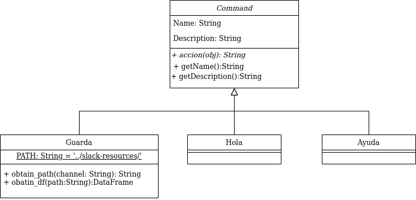
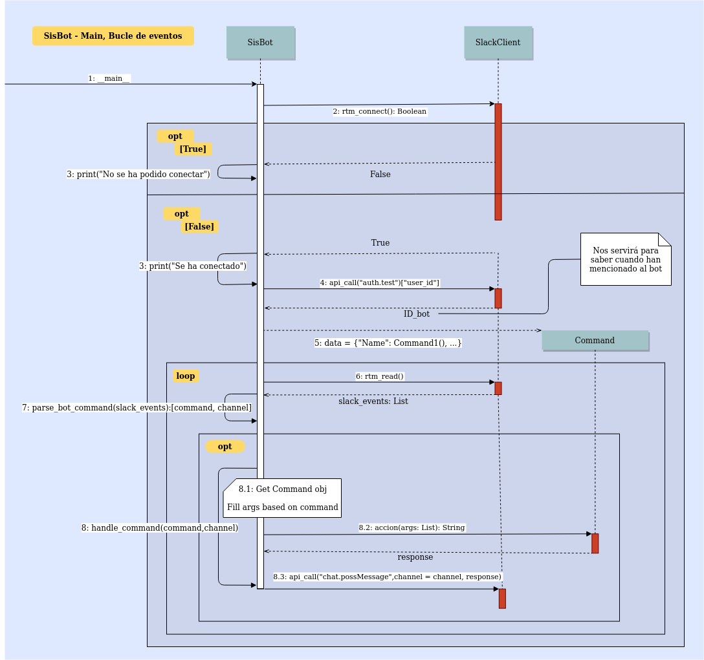

# Como crear un bot para Slack 

### Task List

* [ ] Gestionar posibles fallos 
  * [ ] Dar mensajes más ilustrativos al usuario
  * [ ] Enseñarlos por consola para poder arreglarlos
* [ ] Subir .csv a GitHub
  * [ ] Decidir cada cuanto lo va a subir (Día, actualización, ...)
  * [ ] Crear cuenta y añadir variable de entorno
* [ ] Ver como hacer un rate de las publicaciones (Votos emojis) y ordenarlo por rate
* [ ] Mirar con que pasa si los mensajes llevan... y tratarlos
  * [ ] Saltos de linea
  * [ ] Emojis


### Configuración del bot 

##### Entorno de trabajo y dependencias

Usaremos un entorno virtual para manejar las dependencias del proyecto. Se crea con el siguiente comando `$ virtualenv  -p python3 venv`, se accede a el mediante el comando:  `$ source venv/bin/activate`. 

Una vez dentro instalaremos las dependencias, como por ejemplo,  API de Slack : ` $ pip install slackclient`, esta librería simplifica el uso de Slack's [RTM API](https://translate.googleusercontent.com/translate_c?depth=1&hl=es&rurl=translate.google.com&sl=auto&sp=nmt4&tl=es&u=https://api.slack.com/rtm&usg=ALkJrhiU9_258YSiWjN7_VKqmz6hCLiW_Q) y [Web API](https://translate.googleusercontent.com/translate_c?depth=1&hl=es&rurl=translate.google.com&sl=auto&sp=nmt4&tl=es&u=https://api.slack.com/web&usg=ALkJrhgVw0DrryM9v5fdqjYN5WhxcWOtgg) .

Dejaremos un archivo que indicará las librerías usadas, por lo que para instalarlos deberemos hacer:

 `$ pip install requirements.txt ` 

##### Tokens

Debemos exportar el token de nuestro bot como una variable de entorno porque lo pedirá la librería para estar autorizados para usar  Slack RTM y API web como usuario de bot: 

```shell
$ export SLACK_BOT_TOKEN = 'token_aqui'
```

Para no tener que ponerla cada vez que abramos terminal podemos hacerla una [variable de entorno permanente](https://blog.carreralinux.com.ar/2016/12/uso-de-variables-de-entorno-en-linux-ejemplos/).

##### Posibles problemas y soluciones

A veces da un error por el certificado. La razón por la que esto falla proviene del paquete websocket y del paquete CA que usa (que no está actualizado). 

Se puede solucionar de la siguiente forma:

```shell

$ cd Certificados 
$ wget https://www.tbs-certificats.com/issuerdata/DigiCertGlobalRootCA.crt --no-check-certificate
$ cd ..
$ export WEBSOCKET_CLIENT_CA_BUNDLE="./Certificados/DigiCertGlobalRootCA.crt"
```

Para no tener que ponerla cada vez que abramos terminal podemos hacerla una [variable de entorno permanente](https://blog.carreralinux.com.ar/2016/12/uso-de-variables-de-entorno-en-linux-ejemplos/).

### Ejecución

```shell
$ python sisbot.py
```

### Funcionamiento del bot

###### Diagrama de Clase




###### Diagrama de Flujo



### Enlaces relevantes

- [Como crear un bot en slack](https://api.slack.com/bot-users)
- [API usada](https://slack.dev/python-slackclient/)